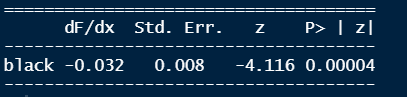
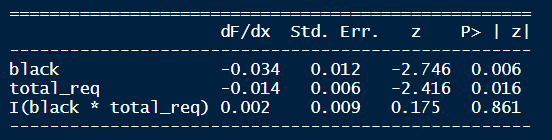

```{r librerias, include=FALSE}
# Librerias
library(tidyverse)
library(RCT)
library(stargazer)
library(devtools)
library(mfx)
library(kableExtra)
library(EnvStats)
library(magrittr)

```


```{r lectura, include=FALSE}
# Lectura 
base_original <- haven::read_stata("data/raw/Names.dta") %>% 
  janitor::clean_names()
```


```{r setup, include=FALSE}
knitr::opts_chunk$set(echo = TRUE)
```


**1.¿Por qué era importante para los autores aleatorizar los nombres? Es decir, ¿por
qué los investigadores no recopilaron información de postulantes verdaderos a los
trabajos y codificaron si los nombres de dichas aplicaciones están más asociados
a afroamericanos o blancos? ¿Qué sesgo (positivo o negativo) crees que hubiera
resultado de seguir esta estrategia?**

Se puede pensar a $D_i = {\{0,1}\}$ como una variable binaria random para indicar si el nombre asignado es común entre afroamericanos.
La pregunta es si $Y_i$ es afectada por el nombre que recibe común a cierto tipo de población
Si los resultados potenciales son:
$$
Y_i = \left\{
\begin{array}{ll}
Y_{1i} & \text{if } D_i =  1 \\
Y_{0i} &  \text{if } D_i = 0 
\end{array}
\right.
$$
En otras palabras, $Y_{0i}$ es cuando no hubo discriminación racial (más llamadas) sin importar si recibió el nombre de blancos o afroamericanos, mientras que $Y_{1i}$ es el caso de que si hubo discriminación (menos llamadas).


$$E\left(Y_i|D_i=1\right) - E\left(Y_i|D_i=0\right) = E\left(Y_{1i}|D_i=1\right) - E\left(Y_{0i}|D_i=1\right) + E\left(Y_{0i}|D_i=1\right) - E\left(Y_{0i}|D_i=0\right)$$
El sesgo de selección se puede ver como el último término de la ecuación de arriba, donde este significa la diferencia en promedio $Y_{0i}$ entre aquellos que recibieron un nombre de población afroamericana y aquellos que recibieron nombres de población blanca. 

Para no tener un sesgo de selección se aletoriza, ya que pudiera ser que los CV's de cierto tipo de población tengan cierta tendencia a ser de un mayor o menor nivel de calidad. El sesgo de selección hubiese resultado positivo si es que por ejemplo la calidad de los CV's de los afroamericanos fuera de menor calidad, entonces esta población tendría una mayor probabilidad de recibir discriminación o menores llamadas de vuelta.
Como resultado nos queda que cualquier diferencia solo se debe a la manipulación de la raza a través del nombre.

**2.Utiliza la base de datos para dar evidencia que la asignación de nombres parece haber sido aleatoria. Deberías incluir la(s) tabla(s) relevante(s) que te haya(n) permitido
llegar a esta conclusión.**

En la tabla 3 se puede observar que la media de años de experiencia por nombre es muy similar entre los tipos de nombres para personas afroamericanas y blancas. De igual forma la dispersión entre años de experiencia entre nombres nos permite afirmar que no hay un patrón que sugiera no se hicieron de forma aleatoria.

En la tabla 4 la media en la calidad de los CV's de acuerdo a la clasificación que se hizo de las variables por parte de los autores nos permite observar que no hay un patrón entre los datos dependiendo los nombres asignados.

En la tabla 5 con medias de cada variable por nombre, nos permite identificar de manera más sencilla que las variables no tienen alguna tendencia mayor para cierto tipo de población dependiendo su nombre.

```{r Summary statistics, echo = FALSE, message = FALSE, results = 'asis'} 
summary_statistics(base_original) %>% 
  as.data.frame() %>% 
  stargazer(type = "latex", summary = FALSE, title = "Summary Statistics",
            header = F, table.placement = "H")
```


```{r, echo = FALSE, message = FALSE, results = 'asis'}

base_original %>% 
  dplyr::select(female, black, high, call_back, chicago) %>%
  balance_table(treatment = "black") %>% 
  as.data.frame() %>% 
  stargazer(type = "latex", title = "Tabla de balance",
            summary = F, header = F)

```
Podemos observar que dado que las diferencias en la tabla de balance no son significativas, por lo que podemos asegurar que el experimento ha sido aleatorio.

```{r, echo = FALSE, message = FALSE, results = 'asis'}

funciones = list(
  "media" = ~mean(.x, na.rm = T), 
  "max" = ~max(.x, na.rm = T), 
  "min" = ~min(.x, na.rm = T),
  "d.e." = ~sd(.x, na.rm = T)
  )

base_original %>% 
  group_by(firstname) %>% 
  summarise(across(.cols = yearsexp, .fns = funciones,
                   .names = "{.fn}")) %>% 
  mutate(across(-firstname, ~round(.x, digits = 2))) %>%  
  as.data.frame() %>% 
  stargazer(type = "latex", summary = F, title = "Años de experiencia", header = F,
            table.placement = "H")

```


```{r, echo = FALSE, message = FALSE, results = 'asis'}

base_original %>% 
  group_by(firstname) %>% 
  summarise(across(.cols = high, .fns = funciones,
                   .names = "{.fn}")) %>% 
  mutate(across(-firstname, ~round(.x, digits = 2))) %>%  
  as.data.frame() %>% 
  stargazer(type = "latex", summary = F,title = "Calidad del CV", header = F,
            table.placement = "H")
```


```{r, echo = FALSE, message = FALSE, results = 'asis'}

base_original %>% 
  group_by(firstname) %>% 
  summarise(Callback = mean(call_back), Female = mean(female), Black = mean(black), 
            HQresume = mean(high), Chicago = mean(chicago), Yearsexp = mean(yearsexp), 
            College = mean(college),Email = mean(email)) %>% 
  kableExtra::kbl(booktabs = T,
      caption = "Características del grupo por nombre",
      digits = c(0, 2, 0, 0, 2, 2, 2, 2, 2)) %>% 
  kableExtra::kable_styling(position = "center", latex_options = "striped",
                full_width = F)
```


\newpage 

**3.La variable black es una dummy creada por los investigadores para señalar si el nombre es usual de afroamericanos. Asumiendo que la distribución de nombres fue aleatoria, da evidencia de si existe discriminación racial en el call back utilizando: (i) un estimador de Neyman, (ii) una estimación de OLS con errores heterocedásticos, (iii) una estimación de OLS agregando controles (ustedes deberán decidir cuáles) y (iv) un probit sin controles.**

**(a) Indica la prueba de hipótesis que estarás contrastando en cada estimación.**

**(b) Reporta los resultados de tus 4 estimaciones con una tabla con el formato usual que empleamos el semestre pasado.**

**(c) Asegúrate que los resultados reportados en cada columna sean comparables. Es decir, deberán estar reportados en las mismas unidades para poder hacer una comparación a lo largo de las columnas.**

**(d) Elige una de las columnas para llevar a cabo una interpretación del coeficiente relevante que estas estimando. Da evidencia como parte de esta interpretación de la importancia del efecto. Es decir, ¿consideras que es un efecto pequeño o grande?**


**1. Estimador de Neyman**

Definimos:

$$ \tau = \frac{1}{N} \sum_{i=1}^{n}(Y_i^T-Y_i^c) $$
Estimador de Neyman:

$$ \hat\tau = \bar Y^1 - \bar Y^0$$
Donde $\bar Y^1$ representa el resultado de la variable call_back si hubo un efecto de tratamiento (nombre afroamericano) y $\bar Y^0$ representa el resultado de la variables call_back si es parte del grupo de control (nombre de blanco).


La prueba de hipótesis relevante es la siguiente:

$$
\left\{
\begin{array}{ll}
H_{0}: &  \tau=0\\
H_{1}: & \tau\neq\ 0
\end{array}
\right.
$$
En promedio importa o no el ser afroamericano para ser llamado por los reclutadores.


```{r estimador de Neyman, echo = FALSE, message = FALSE, results = 'asis'}

attach(base_original)

yiT <- call_back[black == 1] 
yiC <- call_back[black == 0] 

myiT <- mean(yiT)
myiC <- mean(yiC)

tau <- abs(myiT - myiC)


vartau <- var(yiT) / length(yiT) + var(yiC) / length(yiC)
tstat <- tau / sqrt(vartau)

valorp <- 2 * (1 - pnorm(tstat)) 

b <- structure(c(tau, sqrt(vartau), tstat, valorp ), .Dim = c(4L, 1L),
                .Dimnames = list(c("black", "se", "Estadístico t", "Valor-p"),
                                 c(" ")))
stargazer(b, type = "latex", summary = F, header = F,
            table.placement = "H", title = "Estimador de Neyman")

```

Se rechaza H0 a favor de un efecto significativo de ser población afroamericana
Nota: el valor del estimador de Neyman, está en valor absoluto.

\newpage

**2. Estimación de OLS con errores heterocedásticos**

La prueba de hipótesis relevante es la siguiente:

$$
\left\{
\begin{array}{ll}
H_{0}: &  \beta_1=0\\
H_{1}: & \beta_1\neq\ 0
\end{array}
\right.
$$
Existe un efecto diferenciado para los aplicantes para ser llamados si son afroamericanos contra ser blancos.

```{r, include = FALSE, message = FALSE, results = 'asis'}

reg1 <- lm(call_back ~ black)
summary(reg1, robust = T)
robust_se1 <- as.vector(summary(reg1, robust = T)$coefficients[, "Std. Error"])

stargazer(reg1, type = "latex", se = list(robust_se1), summary = F, header = F,
            table.placement = "H")
```


**3. Estimación de OLS agregando controles**

$$
\left\{
\begin{array}{ll}
H_{0}: &  efectos de las variables de control=0\\
H_{1}: & e.o.c
\end{array}
\right.
$$
```{r, include = FALSE, message = FALSE, results = 'asis'}
reg2 <- lm(call_back ~ black + female + I(black * female) +
             high + I(black * high) + chicago)

stargazer(reg1, reg2, type ="latex", summary = F, header = F,
            table.placement = "H")
```


**4. Probit sin controles**

$$
\left\{
\begin{array}{ll}
H_{0}: &  \beta_1=0\\
H_{1}: & \beta_1\neq\ 0
\end{array}
\right.
$$
**Conclusiones:**


En los 3 modelos el hecho de ser hombre afroamericano esta relacionado con una disminucion en la probabilidad de ser llamada por el reclutador. Por otro lado, Neyman nos dice que si existe un efecto diferenciado para la población afroamericana.

Al observar la columna de OLS con errores heterocedásticos (OLS EH) podemos observar que el hecho de ser un hombre afroamericano esta relacionado con una disminución de 3.2 puntos porcentuales en la probabilidad de ser llamado por el reclutador. Además el valor p es signifativo en favor de un efecto en favor del tratamiento de ser afroamericano. Cuando agregas controles el efecto de ser afroamericano es un poco menor. 

\newpage
```{r, echo = FALSE, message = FALSE, results = 'asis'}
probit <- glm(call_back ~ black, family = binomial(link = "probit"))
mfx <- probitmfx(call_back ~ black, base_original)

stargazer(b, reg1, reg2, probit, type ="latex", summary = F,
          title = "Comparación de modelos", digits = 3, 
          column.labels = c("OLS EH", "OLS CONT", "Probit"),
          header = F, table.placement = "H")


#m <- stargazer(mfx$mfxest, type = "text",coef = list(NULL, mfx$mfxest[,1]),
          #se = list(NULL, mfx$mfxest[,2]), header = F, table.placement = "H")
```


Nota: el valor del estimador de Neyman, está en valor absoluto.

\newpage

**4.Imagina que encuentras una noticia que sugiere que la diferencia en el call back es de 1 punto porcentual a favor de los blancos. Establecemos dicha prueba de hipótesis como:**

$$H_{0}:C\beta_{blancos}=C\beta_{afroam} + 0.01$$
**donde CBj es la proporción del grupo j = {blancos; afroam} que reciben una llamada para entrevista (medida entre 0 y 1). Utiliza un Fischer Exact Test para evluar esta hipótesis. Reporta el valor-p y la conclusión a la que llegas.**

Valor-p
```{r, echo = FALSE, message = FALSE, results = 'asis'}
x <- call_back[black == 1]
y <- call_back[black == 0]

Fisher_test <- twoSamplePermutationTestLocation(y, x,
                                   alternative ="two.sided",
                                   mu1.minus.mu2 = 0.01)
Fisher_test[["p.value"]]

```
Se rechaza H0 de que la diferencia en el call_back es de 1pp a favor de los blancos.


**5.Imagina que estratificas por: (i) sexo del aplicante (hombre o mujer), (ii) ciudad donde se postula al trabajo (Chicago o Boston) e (iii) industria de la empresa que publico el puesto (ver el pdf que indica las industrias disponibles) [Ejemplo: un posible estrato sería hombres aplicantes a trabajos en Chicago en la industria manufacturera].**

**Empleando todas las combinaciones posibles de las variables (i)-(iii), utiliza el método de Neyman para calcular el efecto de discrminación en cada estrato (elige el formato que quieras para reportar este resultado, tabla o gráfica). Utilizando los efectos por estrato, calcula el efecto promedio de tratamiento. Compara este estimador promedio y la varianza con el resultado que obtuviste en la pregunta (3).**


```{r, echo = FALSE, message = FALSE, results = 'asis'}

tibble("HChiMa", "HChiTrans", "HChiBan", "HChiTra", "HChiBus", "HChiOth", "HChiMiss", "HBosMa", "HBosTrans", "HBosBan", "HBosTra", "HBosBus", "HBosth",
       "HBosMiss", "MChiMa", "MChiTrans", "MChiBan", "MChiTra", "MChiBus", "MChiOth", "MChiMiss", "MBosMa", "MBosTrans", "MBosBan", "MBosTra", "MBosBus", "MBosth",
       "MBosMiss") %>% 
  pivot_longer(everything(), values_to = "valores", names_to = "Estratos") %>% 
  pull(Estratos) %>% 
    kbl(booktabs = T, linesep = "",  caption = "Estratos",
        col.names = "Estratos") %>% 
  kable_styling(position = "center",
                full_width = F, font_size = 12)


base_original %<>% 
  mutate(d = case_when(black == 1 ~ 1, TRUE ~ 0))

ey0.1 <- base_original %>% 
  filter(d == 1) %>% 
  pull(call_back) %>% 
  mean()

ey0.2 <- base_original %>% 
  filter(d == 0) %>% 
  pull(call_back) %>% 
  mean()

gate <- ey0.1 -  ey0.2


base_original %<>%
  mutate(s = case_when(female == 0 & chicago == 1 &  manuf == 1 ~ 1,
                       female == 0 & chicago == 1 &  transcom == 1 ~ 2,
                       female == 0 & chicago == 1 &  bankreal == 1 ~ 3,
                       female == 0 & chicago == 1 &  trade == 1 ~ 4,
                       female == 0 & chicago == 1 &  busservice == 1 ~ 5,
                       female == 0 & chicago == 1 &  othservice == 1 ~ 6,
                       female == 0 & chicago == 1 &  missind == 1 ~ 7,
                       female == 0 & chicago == 0 &  manuf == 1 ~ 8,
                       female == 0 & chicago == 0 &  transcom == 1 ~ 9,
                       female == 0 & chicago == 0 &  bankreal == 1 ~ 10,
                       female == 0 & chicago == 0 &  trade == 1 ~ 11,
                       female == 0 & chicago == 0 &  busservice == 1 ~ 12,
                       female == 0 & chicago == 0 &  othservice == 1 ~ 13,
                       female == 0 & chicago == 0 &  missind == 1 ~ 14,
                       female == 1 & chicago == 1 &  manuf == 1 ~ 15,
                       female == 1 & chicago == 1 &  transcom == 1 ~ 16,
                       female == 1 & chicago == 1 &  bankreal == 1 ~ 17,
                       female == 1 & chicago == 1 &  trade == 1 ~ 18,
                       female == 1 & chicago == 1 &  busservice == 1 ~ 19,
                       female == 1 & chicago == 1 &  othservice == 1 ~ 20,
                       female == 1 & chicago == 1 &  missind == 1 ~ 21,
                       female == 1 & chicago == 0 &  manuf == 1 ~ 22,
                       female == 1 & chicago == 0 &  transcom == 1 ~ 23,
                       female == 1 & chicago == 0 &  bankreal == 1 ~ 24,
                       female == 1 & chicago == 0 &  trade == 1 ~ 25,
                       female == 1 & chicago == 0 &  busservice == 1 ~ 26,
                       female == 1 & chicago == 0 &  othservice == 1 ~ 27,
                       female == 1 & chicago == 0 &  missind == 1 ~ 28,
                       T ~ 0))

ey11 <- base_original %>% 
  filter(s == 1 & d == 1) %$%
  mean(call_back)
ey10 <- base_original %>% 
  filter(s == 1 & d == 0) %$%
  mean(call_back)

ey21 <- base_original %>% 
  filter(s == 2 & d == 1) %$%
  mean(call_back)
ey20 <- base_original %>% 
  filter(s == 2 & d == 0) %$%
  mean(call_back)

ey31 <- base_original %>% 
  filter(s == 3 & d == 1) %$%
  mean(call_back)
ey30 <- base_original %>% 
  filter(s == 3 & d == 0) %$%
  mean(call_back)

ey41 <- base_original %>% 
  filter(s == 4 & d == 1) %$%
  mean(call_back)
ey40 <- base_original %>% 
  filter(s == 4 & d == 0) %$%
  mean(call_back)

ey51 <- base_original %>% 
  filter(s == 5 & d == 1) %$%
  mean(call_back)
ey50 <- base_original %>% 
  filter(s == 5 & d == 0) %$%
  mean(call_back)

ey61 <- base_original %>% 
  filter(s == 6 & d == 1) %$%
  mean(call_back)
ey60 <- base_original %>% 
  filter(s == 6 & d == 0) %$%
  mean(call_back)

ey71 <- base_original %>% 
  filter(s == 7 & d == 1) %$%
  mean(call_back)
ey70 <- base_original %>% 
  filter(s == 7 & d == 0) %$%
  mean(call_back)

ey81 <- base_original %>% 
  filter(s == 8 & d == 1) %$%
  mean(call_back)
ey80 <- base_original %>% 
  filter(s == 8 & d == 0) %$%
  mean(call_back)

ey91 <- base_original %>% 
  filter(s == 9 & d == 1) %$%
  mean(call_back)
ey90 <- base_original %>% 
  filter(s == 9 & d == 0) %$%
  mean(call_back)

ey101 <- base_original %>% 
  filter(s == 10 & d == 1) %$%
  mean(call_back)
ey100 <- base_original %>% 
  filter(s == 10 & d == 0) %$%
  mean(call_back)

ey111 <- base_original %>% 
  filter(s == 11 & d == 1) %$%
  mean(call_back)
ey110 <- base_original %>% 
  filter(s == 11 & d ==  0) %$%
  mean(call_back)

ey121 <- base_original %>% 
  filter(s == 12 & d == 1) %$%
  mean(call_back)
ey120 <- base_original %>% 
  filter(s == 12 & d == 0) %$%
  mean(call_back)

ey131 <- base_original %>% 
  filter(s == 13 & d == 1) %$%
  mean(call_back)
ey130 <- base_original %>% 
  filter(s == 13 & d == 0) %$%
  mean(call_back)

ey141 <- base_original %>% 
  filter(s == 14 & d == 1) %$%
  mean(call_back)
ey140 <- base_original %>% 
  filter(s == 14 & d == 0) %$%
  mean(call_back)

ey151 <- base_original %>% 
  filter(s == 15 & d == 1) %$%
  mean(call_back)
ey150 <- base_original %>% 
  filter(s == 15 & d == 0) %$%
  mean(call_back)

ey161 <- base_original %>% 
  filter(s == 16 & d == 1) %$%
  mean(call_back)
ey160 <- base_original %>% 
  filter(s == 16 & d == 0) %$%
  mean(call_back)

ey171 <- base_original %>% 
  filter(s == 17 & d == 1) %$%
  mean(call_back)
ey170 <- base_original %>% 
  filter(s == 17 & d == 0) %$%
  mean(call_back)

ey181 <- base_original %>% 
  filter(s == 18 & d == 1) %$%
  mean(call_back)
ey180 <- base_original %>% 
  filter(s == 18 & d == 0) %$%
  mean(call_back)

ey191 <- base_original %>% 
  filter(s == 19 & d == 1) %$%
  mean(call_back)
ey190 <- base_original %>% 
  filter(s == 19 & d == 0) %$%
  mean(call_back)

ey201 <- base_original %>% 
  filter(s == 20 & d == 1) %$%
  mean(call_back)
ey200 <- base_original %>% 
  filter(s == 20 & d == 0) %$%
  mean(call_back)

ey211 <- base_original %>% 
  filter(s == 21 & d == 1) %$%
  mean(call_back)
ey210 <- base_original %>% 
  filter(s == 21 & d == 0) %$%
  mean(call_back)

ey221 <- base_original %>% 
  filter(s == 22 & d == 1) %$%
  mean(call_back)
ey220 <- base_original %>% 
  filter(s == 22 & d == 0) %$%
  mean(call_back)

ey231 <- base_original %>% 
  filter(s == 23 & d == 1) %$%
  mean(call_back)
ey230 <- base_original %>% 
  filter(s == 23 & d == 0) %$%
  mean(call_back)

ey241 <- base_original %>% 
  filter(s == 24 & d == 1) %$%
  mean(call_back)
ey240 <- base_original %>% 
  filter(s == 24 & d == 0) %$%
  mean(call_back)

ey251 <- base_original %>% 
  filter(s == 25 & d == 1) %$%
  mean(call_back)
ey250 <- base_original %>% 
  filter(s == 25 & d == 0) %$%
  mean(call_back)

ey261 <- base_original %>% 
  filter(s == 26 & d == 1) %$%
  mean(call_back)
ey260 <- base_original %>% 
  filter(s == 26 & d ==  0) %$%
  mean(call_back)

ey271 <- base_original %>% 
  filter(s == 27 & d == 1) %$%
  mean(call_back)
ey270 <- base_original %>% 
  filter(s == 27 & d == 0) %$%
  mean(call_back)

ey281 <- base_original %>% 
  filter(s == 28 & d == 1) %$%
  mean(call_back)
ey280 <- base_original %>% 
  filter(s == 28 & d ==  0) %$%
  mean(call_back)

# Diferencias por estrato

diff1 <- ey11 - ey10
diff2 <- ey21 - ey20
diff3 <- ey31 - ey30
diff4 <- ey41 - ey40
diff5 <- ey51 - ey50
diff6 <- ey61 - ey60
diff7 <- ey71 - ey70
diff8 <- ey81 - ey80
diff9 <- ey91 - ey90
diff10 <- ey101 - ey100
diff11 <- ey111 - ey110
diff12 <- ey121 - ey120
diff13 <- ey131 - ey130
diff14 <- ey141 - ey140
diff15 <- ey151 - ey150
diff16 <- ey161 - ey160
diff17 <- ey171 - ey170
diff18 <- ey181 - ey180
diff19 <- ey191 - ey190
diff20 <- ey201 - ey200
diff21 <- ey211 - ey210
diff22 <- ey221 - ey220
diff23 <- ey231 - ey230
diff24 <- ey241 - ey240
diff25 <- ey251 - ey250
diff26 <- ey261 - ey260
diff27 <- ey271 - ey270
diff28 <- ey281 - ey280

 EDE <- tibble(diff1, diff2, diff3, diff4, diff5, diff6, diff7, diff8, diff9, diff10, diff11, diff12, diff13,
       diff14, diff15, diff16, diff17, diff18, diff19, diff20, diff21, diff22, diff23, diff24, diff25,
       diff26, diff27, diff28) %>% 
   pivot_longer(diff1: diff28, values_to = "valores", names_to = "Estratos")
 
EDE %>% 
  kbl(booktabs = T, linesep = , caption = "Efecto de discriminación por estratos") %>% 
  kable_styling(position = "center",
                full_width = F, font_size = 12)
  

EDE %>%
  ggplot() +
  geom_point(aes(x = Estratos, y = valores, color = Estratos), size = 3) +
  ggtitle("Efecto de discriminación por estratos") +
  ggthemes::theme_clean() +
  theme(legend.position = "top")
       
# Estimación de los ponderadores

obs = nrow(base_original)

wt1 <- base_original %>% 
  filter(s == 1 & d == 0) %$%
  nrow(.) / obs

wt2 <- base_original %>% 
  filter(s == 2 & d == 0) %$%
  nrow(.) / obs

wt3 <- base_original %>% 
  filter(s == 3 & d == 0) %$%
  nrow(.) / obs

wt4 <- base_original %>% 
  filter(s == 4 & d == 0) %$%
  nrow(.) / obs

wt5 <- base_original %>% 
  filter(s == 5 & d == 0) %$%
  nrow(.) / obs

wt6 <- base_original %>% 
  filter(s == 6 & d == 0) %$%
  nrow(.) / obs

wt7 <- base_original %>% 
  filter(s == 7 & d == 0) %$%
  nrow(.) / obs

wt8 <- base_original %>% 
  filter(s == 8 & d == 0) %$%
  nrow(.) / obs

wt9 <- base_original %>% 
  filter(s == 9 & d == 0) %$%
  nrow(.) / obs

wt10 <- base_original %>% 
  filter(s == 10 & d == 0) %$%
  nrow(.) / obs

wt11 <- base_original %>% 
  filter(s == 11 & d == 0) %$%
  nrow(.) / obs

wt12 <- base_original %>% 
  filter(s == 12 & d == 0) %$%
  nrow(.) / obs

wt13 <- base_original %>% 
  filter(s == 13 & d == 0) %$%
  nrow(.) / obs

wt14 <- base_original %>% 
  filter(s == 14 & d == 0) %$%
  nrow(.) / obs

wt15 <- base_original %>% 
  filter(s == 15 & d == 0) %$%
  nrow(.) / obs

wt16 <- base_original %>% 
  filter(s == 16 & d == 0) %$%
  nrow(.) / obs

wt17 <- base_original %>% 
  filter(s == 17 & d == 0) %$%
  nrow(.) / obs

wt18 <- base_original %>% 
  filter(s == 18 & d == 0) %$%
  nrow(.) / obs

wt19 <- base_original %>% 
  filter(s == 19 & d == 0) %$%
  nrow(.) / obs

wt20 <- base_original %>% 
  filter(s == 20 & d == 0) %$%
  nrow(.) / obs

wt21 <- base_original %>% 
  filter(s == 21 & d == 0) %$%
  nrow(.) / obs

wt22 <- base_original %>% 
  filter(s == 22 & d == 0) %$%
  nrow(.) / obs

wt23 <- base_original %>% 
  filter(s == 23 & d == 0) %$%
  nrow(.) / obs

wt24 <- base_original %>% 
  filter(s == 24 & d == 0) %$%
  nrow(.) / obs

wt25 <- base_original %>% 
  filter(s == 25 & d == 0) %$%
  nrow(.) / obs

wt26 <- base_original %>% 
  filter(s == 26 & d == 0) %$%
  nrow(.) / obs

wt27 <- base_original %>% 
  filter(s == 27 & d == 0) %$%
  nrow(.) / obs

wt28 <- base_original %>% 
  filter(s == 28 & d == 0) %$%
  nrow(.) / obs

wate = diff1 * wt1 + diff2 * wt2 + diff3 * wt3 + diff4 * wt4 + diff5 * wt5 + diff6 * wt6 + diff7 * wt7 +
  diff8  * wt8 + diff9 * wt9 + diff10 * wt10 + diff11 * wt11 + diff12 * wt12 + diff13 * wt13 + diff14 * wt14 +
  diff15 * wt15 + diff16 * wt16 + diff17 * wt17 + diff18 * wt18 + diff19 * wt19 + diff20 * wt20 +
  diff21 * wt21 + diff22 * wt22 + diff23 * wt23 + diff24 * wt24 + diff25 * wt25 + diff26 * wt26 +
  diff27 * wt27 + diff28 * wt28


kbl(c(wate,gate), booktabs = T, 
    linesep = ,caption = "Diferencia entre el estimador considerando los estratos vs el estimador de Neyman(3)",
    col.names = "Estimador de Neyman") %>% 
  kable_styling(position = "center",
                full_width = F, font_size = 12)

```
\newpage


**6.Replica la primera parte de la Tabla 7 del paper. Solo para el renglón de "Total Number of Requirements" da una interpretación lo más específica posible de la columna "marginal effects." (Ojo: Puedes considerar los errores estándar que arroja por default el software que utilices).**

```{r, include = FALSE, message = FALSE, results = 'asis'}

base_modif <- base_original %>% 
  mutate(total_req = as.numeric(expreq + compreq + comreq + orgreq + educreq))
  

attach(base_modif)

probit_06 <- glm(call_back ~ (black + total_req) + I(black * total_req), family = binomial(link = "probit"))

mfx_06 <- probitmfx(call_back ~ (black + total_req) + I(black * total_req), base_modif) 

stargazer(mfx_06$mfxest, type = "text",coef = list(NULL, mfx_06$mfxest[,1]),
          se = list(NULL, mfx_06$mfxest[,2]))


```


Observamos que el dato que buscamos es el que pertenece a la interacción de black con total requirement y es el mismo dato que en la tabla 7. 

Un aumento en 1 unidad de requerimientos totales, está relacionado con un aumento de 0.2 pts porcentuales en la probablidad de recibir una llamada de vuelta por parte de los reclutadores para la población afroamericana en comparación con la población blanca. Sin embargo, el dato resulta ser no significativo.


**7.Quisieras saber si la discriminación racial disminuye conforme aumenta la experiencia laboral de los aplicantes. Elige el método y formato que prefieras para reportar tus resultados. Muestra claramente qué parámetro o combinación de parámetros contestan tu pregunta**

```{r, echo = FALSE, message = FALSE, results = 'asis'}

probit_07 <- glm(call_back ~ black + yearsexp + I(black * yearsexp) + I(yearsexp * yearsexp) + I(black * yearsexp * yearsexp), family = binomial(link = "probit"))
#probitmfx(call_back ~ black + yearsexp + I(black * yearsexp)+ I(yearsexp * yearsexp), base_original)


ols7 <- lm(call_back ~ black + yearsexp + I(black * yearsexp) + I(yearsexp * yearsexp) + I(black * yearsexp * yearsexp) )

stargazer(ols7, probit_07,type ="latex", summary = F, header = F,
            table.placement = "H")


```
Se puede observar como para la interacción de la variable black con years (ATE|exp), tiene un signo negativo por lo que no aumenta la probabilidad de ser llamado de vuelta por los reclutadores para los afroamericanos, sin embargo, en el caso de la variable year, si hay un efecto positivo en la probabilidad de ser llamado de vuelta, ya sea para el caso del modelo de probabilidad lineal donde la interpretación es directa o el probit.


**8.Por último, imagina que el gobierno esta interesado en replicar este estudio en México para ver posible discriminación en contra de indígenas. Te pide que lo asesores para definir el número de CVs ficticios (aplicaciones) que necesita realizar. Realiza cálculos de poder para indicar:**

**(a) ¿Cuántos CVs ficticios necesitará aleatorizar si es que: (i) tu anticipas que los efectos (varianza y efecto real) sean iguales a los obtenidos por Bertrand y Mullainathan, (ii) quieres un poder estadístico de 85%, (iii) asumes una significancia de 1%, y (iv) vas a dividir 50-50 tratamiento y control?**

**(b) En R o Stata, produce una gráca que ilustre el tradeoff entre poder estadístico y proporción de tratamiento y control (similar a lo que hicimos con Optimal Design) Dejando los valores que obtuviste en el inciso anterior (número de observaciones,efectos reales y significancia).**


Número de CV's 3768
```{r, echo = FALSE, message = FALSE, results = 'asis'}
mue_com <- var(call_back)
gamma <- 0.5
phi <- 0.85
prim_parte <- pnorm(phi, mean = 0, sd = 1, lower.tail = T, log.p = F)
seg_parte <- pnorm(1 - (0.01 / 2), mean = 0, sd = 1, lower.tail = T, log.p = F)
power.t.test(d = -tau, sig.level = 0.01, power = 0.85, sd = sqrt(mue_com), alternative = "two.sided")

```


```{r, echo = FALSE, message = FALSE, results = 'asis'}
# primera forma
#funcion_poder = function(x){pnorm(sqrt(3768 * (tau ^ 2 / var(call_back)) * x * (1 - x)) - qnorm(1 - (0.01 / 2)))}
#curve(funcion_poder)

gamma1 <- seq(from = 0, to = 1, by = 0.1)
nuevo <- (gamma1 * (1 - gamma1) * 778.50 * (tau ^ {2} / mue_com))^{1/2} - seg_parte

#Se buscaron los datos en el vector nuevo en las tablas 
distacum <- c(0.2005, 0.5557, 0.6808, 0.7454, 0.7764, 0.7881, 0.7764, 0.7454, 0.6808, 0.5557, 0.2005)
conj <- tibble(gamma1, nuevo, distacum)

conj %>%
  ggplot() +
  geom_line(aes(x = gamma1, y = distacum), color = "#9d0208", size = 1.5) +
  labs(fill = 'am',
       x = 'Proporcion de tratamiento',
       y = 'Poder estadístico',
       title = 'Tradeoff entre poder estadítico y proporción de tratamiento y control') +
  ggthemes::theme_clean()
```

